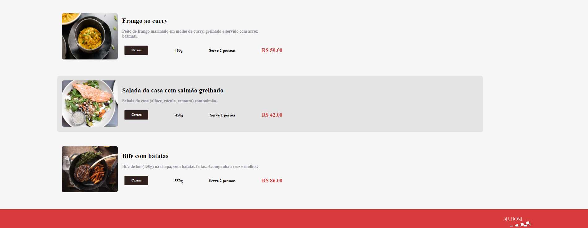
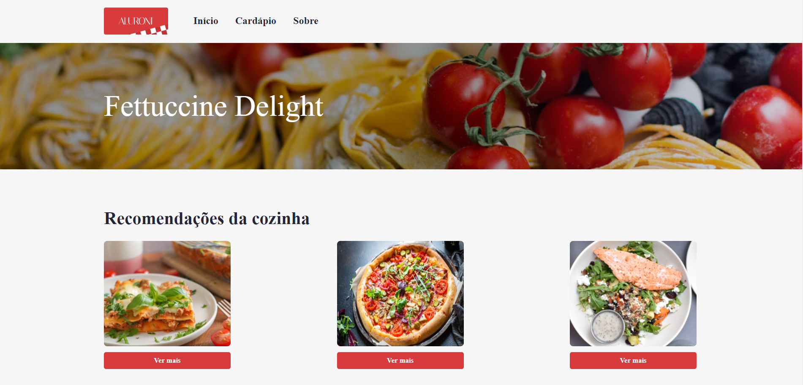

<body>
<h1>React com TypeScript</h1>

Este repositório contém o código-fonte e os arquivos relacionados ao projeto "Lidando com Arquivos Estáticos em React". Este projeto foi desenvolvido com o intuito de explorar e aplicar boas práticas no desenvolvimento de aplicações React, utilizando Create React App e explorando a manipulação de arquivos estáticos, estilos e componentes.

    

    

<h2>Objetivos do Projeto</h2>

O projeto abrange os seguintes tópicos:

<ul>
    <li>Criação de um projeto React do zero usando Create React App.</li>
    <li>Utilização do <code>normalize.css</code> para redefinir os estilos padrões dos navegadores.</li>
    <li>Configuração de imports absolutos para simplificar a estrutura de importação de arquivos.</li>
    <li>Aplicação de boas práticas de CSS, incluindo a criação e uso de variáveis, além de arquivos específicos para variáveis e breakpoints em media-queries.</li>
    <li>Utilização do pacote <code>classnames</code> para trabalhar com CSS Modules de forma simplificada e lidar com estilos condicionais.</li>
    <li>Exploração do pacote SVGR para importar arquivos SVG como componentes React.</li>
    <li>Compreensão de como o React lida com os imports estáticos, tanto em arquivos .js quanto em arquivos de estilos (.scss ou .css). Aprendizado sobre a importação de arquivos estáticos como variáveis via JavaScript ou a utilização da pasta <code>public</code> para importações dinâmicas de arquivos estáticos.</li>
    <li>Aprofundamento na Estrutura básica do Router DOM, compreendendo como ele gerencia a navegação entre componentes React.</li>
    <li>Passos detalhados para a criação de rotas no projeto, permitindo a navegação eficiente entre diferentes páginas ou seções da aplicação.</li>
    <li>Exploração dos Router DOM Hooks, destacando como eles podem ser utilizados para acessar e manipular informações sobre as rotas atuais.</li>
    <li>Ajustes detalhados na implementação do componente NotFound, abordando estratégias para lidar com rotas inexistentes.</li>
    <li>Configuração do componente Header no contexto do Router DOM, proporcionando uma experiência de navegação consistente e intuitiva.</li>
</ul>

    

<h2>Como Utilizar Este Repositório</h2>

Este repositório contém os arquivos e o código-fonte do projeto. Para executar e explorar localmente, siga estas etapas:

<ol>
    <li><strong>Clonagem do Repositório:</strong> Clone este repositório em sua máquina local usando o comando:</li>
</ol>
<pre>
git clone &lt;URL_do_repositório&gt;
</pre>
<ol start="2">
    <li><strong>Instalação de Dependências:</strong> Após clonar o repositório, navegue até a pasta do projeto e instale as dependências usando npm ou yarn:</li>
</ol>
<pre>
npm install
</pre>

ou

<pre>
yarn install
</pre>
<ol start="3">
    <li><strong>Execução do Projeto:</strong> Uma vez instaladas as dependências, inicie o projeto com o comando:</li>
</ol>
<pre>
npm start
</pre>

ou

<pre>
yarn start
</pre>

Isso iniciará a aplicação React localmente. Certifique-se de possuir o Node.js e npm (ou yarn) instalados em sua máquina.

Este projeto é resultado do curso "Lidando com Arquivos Estáticos em React" da plataforma Alura, abordando uma série de práticas e técnicas fundamentais para o desenvolvimento em React.

</body>
</html>
